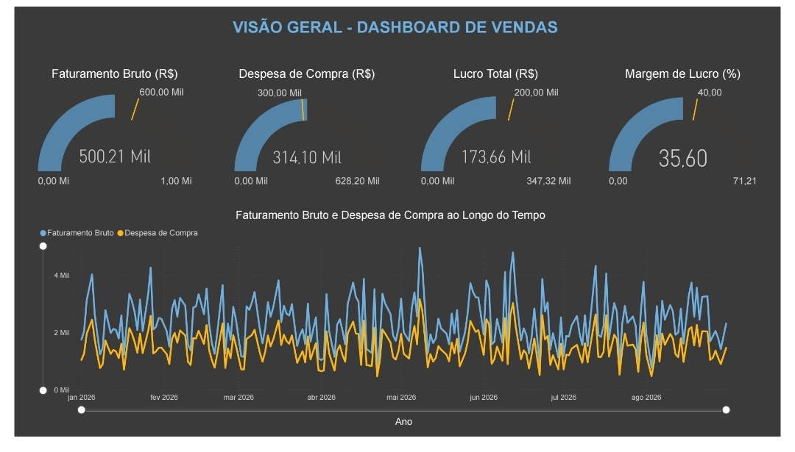
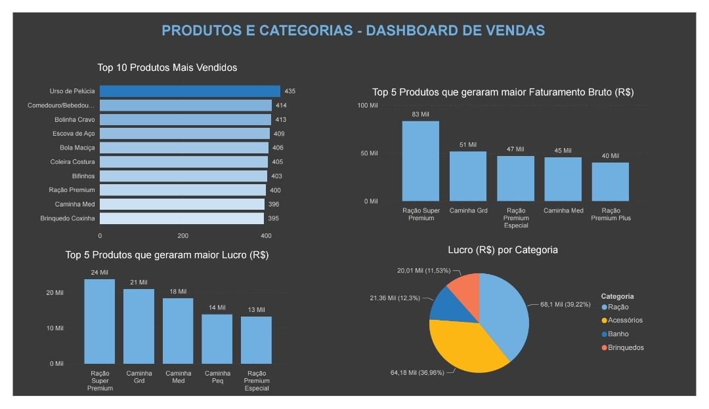

# 📊 Análise de Vendas

Projeto de análise de dados desenvolvido com o objetivo de transformar dados de vendas em informações relevantes para auxiliar na tomada de decisões da empresa.

O projeto contempla desde a **geração e preparação de dados sintéticos**, passando pela **modelagem de um Data Warehouse**, até a construção de um **dashboard interativo no Power BI** para análise dos principais indicadores de vendas, produtos, categorias, vendedores e clientes.

---

## 🎯 Objetivo

O objetivo do projeto é analisar o desempenho comercial da empresa por meio de indicadores de faturamento, despesas, lucro, margem de lucro e volume de vendas.

A análise busca responder perguntas de negócio relacionadas a:

* Desempenho financeiro da empresa;
* Evolução do faturamento e das despesas ao longo do tempo;
* Produtos e categorias com melhor desempenho;
* Desempenho individual dos vendedores;
* Clientes que mais contribuem para o faturamento;
* Distribuição do faturamento por bairros.

---

## 💼 Perguntas de Negócio

### Visão Geral

1. Qual foi o faturamento bruto total?
2. Qual foi a despesa total com a compra dos produtos?
3. Qual foi o lucro total?
4. Qual foi a margem de lucro?
5. Como ocorreu a variação do faturamento e das despesas ao longo do tempo?

### Metas da Empresa

| Indicador           |       Meta |
| ------------------- | ---------: |
| Faturamento Bruto   | R$ 600.000 |
| Despesa com Compras | R$ 300.000 |
| Lucro Total         | R$ 200.000 |
| Margem de Lucro     |        40% |

### Produtos e Categorias

6. Quais foram os 10 produtos com maior quantidade vendida?
7. Quais foram os 5 produtos que geraram maior faturamento bruto?
8. Quais foram os 5 produtos que geraram maior lucro?
9. Quais categorias apresentaram maior lucro?

### Vendedores

10. Quais vendedores geraram maior faturamento bruto?
11. Qual foi a quantidade de vendas realizada por cada vendedor?
12. Como foi o lucro gerado por cada vendedor ao longo do tempo?

### Clientes

13. Quais clientes geraram maior faturamento bruto?
14. Quais clientes realizaram mais compras?
15. Quais bairros tiveram maior participação no faturamento?

---

## 🏗️ Arquitetura do Projeto

O projeto foi desenvolvido seguindo uma abordagem de **Data Warehouse com modelagem dimensional**, utilizando um modelo em estrela.

A tabela fato de vendas é relacionada às principais dimensões utilizadas na análise.

### Tabela fato

**fato_venda**

* id_venda
* data
* id_cliente
* id_vendedor
* id_formapag
* id_produto
* quantidadeVendida
* desconto
* custoTotal
* valorVendaBruta

### Dimensões

**dim_data**

* dataCompleta
* dia
* mes
* nomeMes
* ano
* diaSemana

**dim_cliente**

* id_cliente
* nome
* telefone
* endereco
* bairro
* CPF

**dim_vendedor**

* id_vendedor
* nome

**dim_formapagamento**

* id_formapag
* tipo

**dim_produto**

* id_produto
* nome
* precoCusto
* precoVenda
* quantidadeEstoque
* id_categoria

**dim_categoria**

* id_categoria
* nome
* descricao

---

## 🔄 Processo de Dados

O projeto foi desenvolvido seguindo as seguintes etapas:

1. **Geração dos dados**

   * Criação de uma base de dados sintética para representar as operações de vendas da empresa.

2. **Tratamento e preparação**

   * Utilização de Python e Pandas para organização e preparação dos dados.

3. **Modelagem**

   * Estruturação dos dados em um modelo dimensional;
   * Construção do Data Warehouse utilizando o conceito de modelo estrela.

4. **Cálculo dos indicadores**

   * Criação das métricas necessárias para análise de faturamento, despesas, lucro, margem e volume de vendas.

5. **Visualização**

   * Desenvolvimento de dashboards no Power BI;
   * Criação de indicadores, gráficos e análises para responder às perguntas de negócio.

6. **Documentação**

   * Exportação dos dashboards em PDF para documentação e apresentação dos resultados.

---

## 📊 Dashboard

O dashboard foi desenvolvido no **Power BI** com foco na análise do desempenho comercial.





As análises foram organizadas considerando diferentes perspectivas do negócio:

### 💰 Visão Financeira

* Faturamento bruto;
* Despesas com compras;
* Lucro total;
* Margem de lucro;
* Comparação com as metas estabelecidas;
* Evolução de faturamento e despesas ao longo do tempo.

### 📦 Produtos e Categorias

* Ranking dos produtos mais vendidos;
* Produtos com maior faturamento;
* Produtos com maior geração de lucro;
* Lucro por categoria.

### 👨‍💼 Vendedores

* Faturamento por vendedor;
* Quantidade de vendas por vendedor;
* Evolução do lucro por vendedor ao longo do tempo.

### 👥 Clientes

* Clientes com maior faturamento;
* Clientes com maior quantidade de compras;
* Participação dos bairros no faturamento.

---

## 🛠️ Tecnologias Utilizadas

### Linguagem

* **Python**

### Tratamento e análise de dados

* **Pandas**
* **NumPy**

### Visualização

* **Matplotlib**
* **Power BI**

### Banco de dados e SQL

* **PostgreSQL**
* **SQL**
* **Docker**
* **pgAdmin**

### Desenvolvimento

* **Jupyter Notebook**

---

## 📁 Estrutura do Projeto

```text
analise-vendas/
│
├── data/
│   ├── dim_categoria.csv
│   ├── dim_cliente.csv
│   ├── dim_data.csv
│   ├── dim_formapagamento.csv
│   ├── dim_produto.csv
│   ├── dim_vendedor.csv
│   └── fato_venda.csv
│
├── scripts/
│   └── carregamentoTabelas.py
|
├── notebooks/
│   ├── carregamentoTabelas.ipynb
│   └── limpeza_tratamento.ipynb
│
├── powerbi/
│   └── dashboard_vendas.pbix
│
├── sql/
│   └── modelo_fisico.sql
│
├── docs/
│   ├── dashboard_vendas.pdf
│   ├── documentacao_modelo.txt
│   ├── documentacao_modelo.pdf
│   ├── dashboard.jpg
│   ├── dashboard1.jpg
│   └── perguntas_de_negocio.md
│
├── README.md
├── .env.example
├── requirements.txt
└── docker-compose.yml
```

---

## 📌 Principais Objetivos da Análise

Através do dashboard, é possível identificar:

* O desempenho financeiro geral da empresa;
* A evolução dos resultados ao longo do tempo;
* Os produtos responsáveis pelo maior volume de vendas;
* Os produtos que mais contribuem para o faturamento e lucro;
* As categorias mais rentáveis;
* Os vendedores com melhor desempenho;
* Os clientes mais relevantes para o faturamento;
* Os bairros com maior participação nas vendas.

---

## 🚀 Como Executar o Projeto

### 1. Clonar o repositório

```bash
git clone https://github.com/PabloLanza/analise_vendas_petshop
```

### 2. Instalar as dependências

```bash
pip install -r requirements.txt
```

### 3. Executar os scripts

Os scripts presentes na pasta `scripts/` e `notebooks/` são responsáveis pela geração e preparação dos dados utilizados no projeto.

### 4. Visualizar o Dashboard

Abra o arquivo `.pbix` presente na pasta `powerbi/` utilizando o **Power BI Desktop**.

---

## 📄 Documentação

O projeto também possui uma versão em PDF do dashboard, permitindo visualizar os resultados da análise sem a necessidade de abrir o arquivo do Power BI.

---

## 👨‍💻 Autor

**Pablo Augusto Lanza França**

Projeto desenvolvido como parte do processo de desenvolvimento de conhecimentos em **Análise de Dados, Python, SQL, Data Warehouse e Power BI**.
